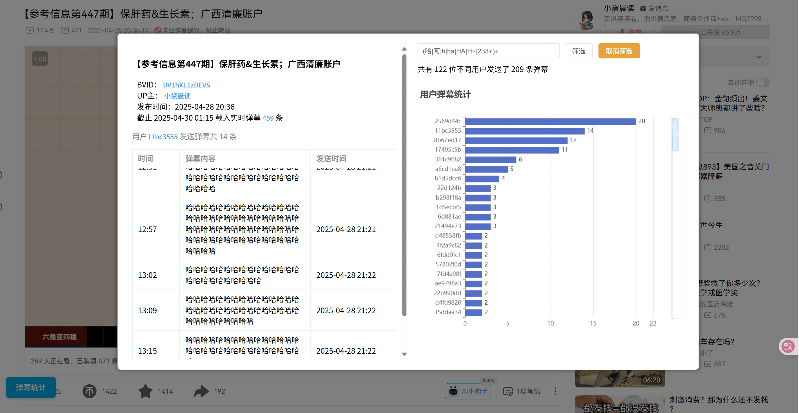

# B站视频弹幕统计
获取B站视频页弹幕数据，并生成统计页面。**看看到底是哪个b崽子弹幕刷屏🔪**

### 使用方法
1. 点击左下角“弹幕统计”按钮会弹出统计面板，点击其他区域收回。弹幕越多加载越慢，请等一会。
2. 右上方文本框输入正则表达式，可筛选弹幕。
3. 点击条形图可单独查看某用户发的弹幕。再点击左边的用户midhash可反查用户📦。
4. 点击弹幕列表可定位发送者在条形图中的位置。鼠标悬浮于弹幕内容上显示发送者和屏蔽等级（屏蔽等级低于用户设定等级的弹幕将被屏蔽，也就是说越低越容易被屏蔽）
5. 右上方“载入实时弹幕xx条”的链接点开为弹幕xml文件，ctrl+s下载
6. 还可下载视频封面、up头像等

### 注意
- 实时弹幕池容量有限（根据视频类型500-8000条不等）
- midHash为用户id的哈希，想获得用户id可以暴力搜索。参考[怎么根据 midHash 反查 用户id?](https://github.com/SocialSisterYi/bilibili-API-collect/issues/698#issuecomment-1577172809)、["mid_hash" 反查为 “mid”](https://github.com/Aruelius/crc32-crack)。
- 需注意10位数以上的用户id很可能查不到或查错 [UID讲解](https://www.bilibili.com/opus/921946620241641476)

### 感谢
- 大力感谢ChatGPT完成了80%的工作
- [bilibili-API-collect](https://github.com/SocialSisterYi/bilibili-API-collect)
  - [xml实时弹幕](https://github.com/SocialSisterYi/bilibili-API-collect/blob/master/docs/danmaku/danmaku_xml.md)
  - [视频基本信息](https://github.com/SocialSisterYi/bilibili-API-collect/blob/master/docs/video/info.md)
- [BiliBili_crc2mid](https://github.com/shafferjohn/bilibili-search)

---
### 更新

**版本1.1**
- 优化弹幕统计ui，平时会隐藏于左下角
- 更新反查用户功能
  封面、up头像查看
